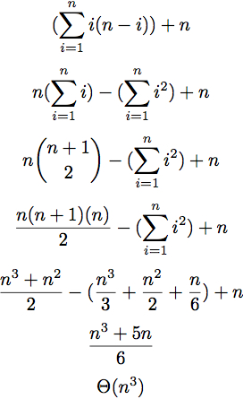

# Spelling English Words with Elemental Symbols

An algorithm to spell an input English word using chemical symbols so that leftover letters are minimized. The optimal solutions with that uses the fewest chemical symbols is chosen.  

For instance, "eras" would be spelled as `Er` `As` rather than e `Ra` s because the first spelling has 0 letters not contained in the elemental symbols while the second has 2 leftover letters.  

Additionally, "rhinos" would be spelled as `Rh` `In` `Os` rather than `Rh` `I` `No` `S` because, while both are optimal, the first spelling uses 3 symbols and the second uses 4.

## Dynamic Programming Solution

The data structure is a table of optimal solutions. We use this so we do not resolve overlapping subproblems.

         END INDEX
      0 1 2 ... k-1
L   1 X X X       X 
E   2   X X       X
N 
G   |
T
H   k             X

Each entry stores the number of characters in the corresponding subsequence that are covered by the optimal periodic spelling. In the first and second rows, we check if each subsequence matches any elemental symbol. From the second row onward, we also determine the optimal periodic spelling by splitting each subsequence into two subproblems (at each character) and summing the stored optimal solutions to those subproblems.

## Time Complexity

Each of the i entries in row i must be filled. For a subsequence in row i, we partition the subsequence into two strings of positive length. There are i-1 ways to do this. 

  

